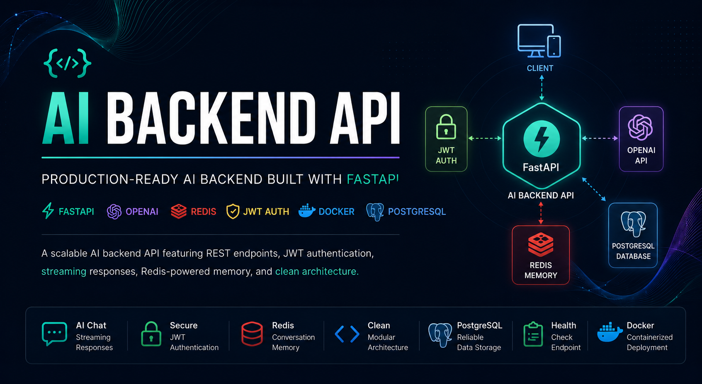
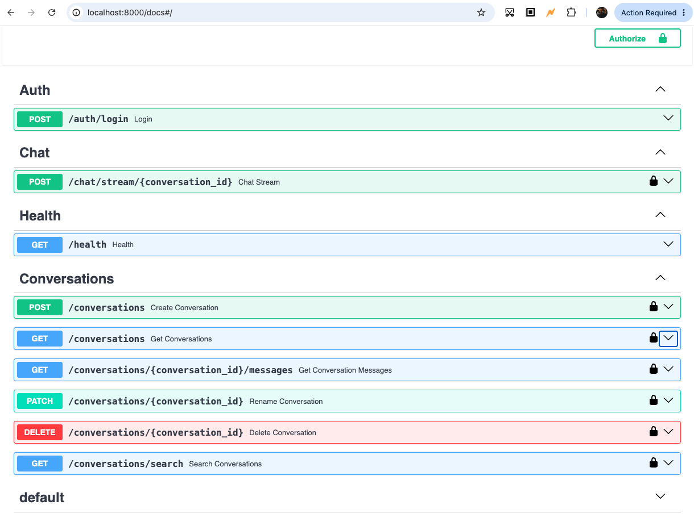

# AI-backend-API---Python

<p align="center">
  
</p>

<h1 align="center">AI Backend API</h1>

<p align="center">
Production-ready AI Backend built with FastAPI, OpenAI, Redis, Docker, and JWT Authentication.
</p>

<p align="center">
  
</p>

<p align="center">


</p>
A production-style AI backend built with **FastAPI**, **OpenAI**, **Redis**, and **JWT Authentication**.

This project demonstrates modern backend engineering practices, including secure authentication, streaming AI responses, centralized configuration, structured logging, Redis-backed conversation memory, and production-ready API architecture.

---

## Features

- JWT Authentication
- Streaming AI Responses
- PostgreSQL Persistence
- Redis Conversation Cache
- AI-generated Conversation Titles
- Conversation CRUD
- Message Persistence
- Docker Support
- Alembic Migrations
- Structured Logging
- Global Exception Handling

---

## Tech Stack

- FastAPI
- OpenAI API
- PostgreSQL
- SQLAlchemy
- Alembic
- Redis
- JWT Authentication
- Docker
- Pydantic

---

## Project Structure

```text
app/

├── auth/
├── core/
├── database/
├── middleware/
├── models/
├── routes/
├── services/
│   ├── ai_service.py
│   ├── cache_service.py
│   ├── conversation_service.py
│   ├── conversation_repository.py
│   ├── message_service.py
│   ├── title_service.py
│   └── user_service.py
```

---

## API Endpoints

| Method | Endpoint | Description | Status |
|--------|----------|-------------|--------|
| POST | `/auth/login` | Authenticate user and return JWT. | ✅ Complete |
| POST | `/conversations` | Create a conversation. | ✅ Complete |
| GET | `/conversations` | List conversations. | ✅ Complete |
| GET | `/conversations/{conversation_id}/messages` | Load conversation history. | ✅ Complete |
| PATCH | `/conversations/{conversation_id}` | Rename conversation. | ✅ Complete |
| DELETE | `/conversations/{conversation_id}` | Delete conversation. | ✅ Complete |
| POST | `/chat/stream/{conversation_id}` | Stream AI responses. | ✅ Complete |
| GET | `/health` | Health check endpoint. | ✅ Complete |
---


<p align="center">
  
</p>


## Running the Project

Install dependencies:

```bash
pip install -r requirements.txt
```

Start Redis:

```bash
redis-server
```

Run the API:

```bash
uvicorn app.main:app --reload
```

Open Swagger:

```
http://127.0.0.1:8000/docs
```

---

## Current Features

- 🔐 JWT Authentication
- 🤖 OpenAI Streaming Responses
- 💬 Conversation Management
- 🧠 AI-Generated Conversation Titles
- 🗄️ PostgreSQL Persistence
- ⚡ Redis Caching
- 🐳 Docker Support
- 📈 Structured Logging
- 🔄 Alembic Database Migrations

---

## Planned Features
- ⏳ Vector Database (pgvector)
- ⏳ Retrieval-Augmented Generation (RAG)
- ⏳ PDF Knowledge Uploads
- ⏳ Semantic Search
- ⏳ Conversation Search
- ⏳ Pagination
- ⏳ Favorites
- ⏳ Conversation Archive
- ⏳ Background Workers
- ⏳ Rate Limiting

---

## Author

**Marvin Elmore**

Senior Full Stack Software Engineer

GitHub: https://github.com/marvinelmore
